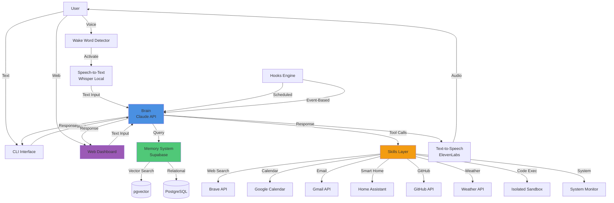

# Design Document: JARVIS Personal AI Assistant

## Overview

JARVIS is a full-stack, always-on intelligent personal AI assistant that provides voice and text-activated interaction with persistent memory, proactive behaviors, and extensible skill-based capabilities. The system architecture follows a modular design with clear separation between the reasoning engine (Brain), persistent storage (Memory System), interaction interfaces (Voice, Dashboard), and executable capabilities (Skills).

### Core Design Principles

1. **Modularity**: Each subsystem (Brain, Memory, Voice, Skills) operates independently with well-defined interfaces
2. **Extensibility**: New skills can be added through the MCP tool protocol without modifying core systems
3. **Privacy-First**: Audio processing happens locally; only text is sent to cloud LLM services
4. **Persistence**: All interactions, preferences, and learned behaviors survive system restarts
5. **Proactive Intelligence**: The system anticipates user needs based on learned patterns and context

### Technology Stack

- **Backend**: Python 3.11+ for Brain and Skills orchestration
- **LLM**: Claude API (claude-sonnet-4-20250514) for reasoning
- **Memory**: Supabase (PostgreSQL + pgvector) for vector and relational storage
- **Voice**: OpenAI Whisper (local) for STT, ElevenLabs API for TTS, Porcupine for wake word
- **Frontend**: React + Tailwind CSS for web dashboard
- **Deployment**: Docker Compose for orchestration
- **Authentication**: JWT for dashboard access
- **Task Scheduling**: APScheduler for hooks and reminders

## Architecture

### System Architecture Diagram



### Component Interaction Flow

1. **Input Flow**: User → Interface (Voice/CLI/Dashboard) → Brain
2. **Processing Flow**: Brain → Memory (context injection) → LLM Reasoning → Tool Selection
3. **Execution Flow**: Brain → Skills → External APIs → Results
4. **Output Flow**: Brain → TTS/Dashboard/CLI → User
5. **Learning Flow**: Interaction → Episodic Memory → Preference Extraction → Personal Profile Update

## Components and Interfaces

### 1. Brain (Reasoning Engine)

**Responsibility**: Natural language understanding, conversation management, tool selection, and decision-making.

**Interface**:
```python
class Brain:
    def process_input(self, user_input: str, session_id: str) -> BrainResponse:
        """Process user input and generate response with tool calls."""
        pass
    
    def execute_tool_call(self, tool_name: str, parameters: dict) -> ToolResult:
        """Execute a skill with validated parameters."""
        pass
    
    def calculate_confidence(self, response: str) -> int:
        """Calculate confidence score (0-100) for a response."""
        pass
    
    def inject_memory_context(self, session_id: str) -> str:
        """Load relevant memory context into system prompt."""
        pass
```

**Key Behaviors**:
- Maintains conversation context for last 20 exchanges within a session
- Generates confidence scores for all responses
- States uncertainty explicitly when confidence < 70
- Validates tool parameters before invocation
- Requires confirmation for irreversible actions

**Dependencies**:
- Claude API for LLM reasoning
- Memory System for context injection
- Skills registry for tool availability

### 2. Memory System

**Responsibility**: Persistent storage of conversations, preferences, episodic logs, and semantic search.

**Interface**:
```python
class MemorySystem:
    def store_conversation(self, session_id: str, exchange: ConversationExchange) -> None:
        """Store a conversation turn in vector and relational storage."""
        pass
    
    def semantic_search(self, query: str, limit: int = 5) -> List[Memory]:
        """Search memories by semantic similarity."""
        pass
    
    def get_personal_profile(self, user_id: str) -> PersonalProfile:
        """Retrieve user preferences and learned behaviors."""
        pass
    
    def update_preference(self, user_id: str, key: str, value: Any) -> None:
        """Update a user preference in the profile."""
        pass
    
    def log_episodic_memory(self, interaction: Interaction) -> None:
        """Log an interaction with timestamp and outcome."""
        pass
    
    def inject_context(self, session_id: str) -> str:
        """Generate context string from relevant memories."""
        pass
```

**Data Models** (see Data Models section below)

**Performance Requirements**:
- Semantic search: < 500ms response time
- Context injection: < 200ms
- Profile updates: < 100ms

**Dependencies**:
- Supabase PostgreSQL for relational data
- Supabase pgvector for vector embeddings
- Embedding model for text vectorization

### 3. Voice Interface

**Responsibility**: Wake word detection, speech-to-text conversion, and text-to-speech output.

**Interface**:
```python
class VoiceInterface:
    def start_wake_word_detection(self) -> None:
        """Start listening for 'Hey Jarvis' wake word."""
        pass
    
    def on_wake_word_detected(self, callback: Callable) -> None:
        """Register callback for wake word detection."""
        pass
    
    def speech_to_text(self, audio: bytes) -> str:
        """Convert audio to text using local Whisper."""
        pass
    
    def text_to_speech(self, text: str) -> bytes:
        """Convert text to audio using ElevenLabs."""
        pass
    
    def play_audio(self, audio: bytes) -> None:
        """Play audio output to speakers."""
        pass
```

**Key Behaviors**:
- Wake word detection runs continuously in background
- STT processing happens locally (privacy-first)
- TTS uses ElevenLabs for natural voice quality
- Falls back to text interface if voice fails

**Dependencies**:
- Porcupine/Picovoice for wake word detection
- OpenAI Whisper (local) for STT
- ElevenLabs API for TTS
- Audio I/O libraries (PyAudio, sounddevice)

### 4. Skills Layer

**Responsibility**: Executable tools that perform specific actions (web search, calendar, email, etc.).

**Interface** (MCP Tool Protocol):
```python
class Skill:
    name: str
    description: str
    parameters: dict  # JSON schema
    
    def execute(self, **kwargs) -> SkillResult:
        """Execute the skill with provided parameters."""
        pass
    
    def validate_parameters(self, **kwargs) -> bool:
        """Validate parameters against schema."""
        pass
```

**Implemented Skills**:
1. **web_search**: Brave/Serper API integration
2. **run_code**: Sandboxed Python/JS/Bash execution
3. **get_weather**: Weather API integration
4. **manage_calendar**: Google Calendar CRUD operations
5. **manage_email**: Gmail read/summarize/draft
6. **smart_home**: Home Assistant REST API
7. **github_summary**: GitHub API for PRs/issues/commits
8. **daily_brief**: Aggregates weather/calendar/email/news
9. **set_reminder**: Cron-based reminder scheduling
10. **system_status**: Local system monitoring

**Skill Registration**:
```python
class SkillRegistry:
    def register_skill(self, skill: Skill) -> None:
        """Register a skill for Brain to use."""
        pass
    
    def get_skill(self, name: str) -> Skill:
        """Retrieve a skill by name."""
        pass
    
    def list_skills(self) -> List[Skill]:
        """List all registered skills."""
        pass
```

### 5. Hooks Engine

**Responsibility**: Automated behaviors triggered by time, events, or system state.

**Interface**:
```python
class HooksEngine:
    def register_hook(self, hook: Hook) -> None:
        """Register a scheduled or event-based hook."""
        pass
    
    def execute_hook(self, hook_id: str) -> None:
        """Execute a hook manually."""
        pass
    
    def list_active_hooks(self) -> List[Hook]:
        """List all active hooks."""
        pass
```

**Implemented Hooks**:
1. **Morning Brief Hook**: Daily at 7:00 AM (configurable)
2. **Preference Learning Hook**: After every conversation turn
3. **Calendar Reminder Hook**: Every 5 minutes, checks for events within 15 minutes

**Hook Types**:
- **Time-based**: Cron schedule (e.g., daily at 7 AM)
- **Event-based**: Triggered by system events (e.g., after conversation)
- **Interval-based**: Periodic checks (e.g., every 5 minutes)

### 6. Web Dashboard

**Responsibility**: Visual interface for monitoring, controlling, and configuring JARVIS.

**Pages**:
1. **Conversation Feed**: Real-time display of all interactions
2. **Memory Browser**: View, edit, delete stored memories
3. **Skills Status**: Health check for all skills
4. **Daily Brief Card**: Weather, calendar, email summary
5. **Settings**: Voice toggle, wake word, LLM model, API keys
6. **Audit Log**: Security log of all actions

**Technology**:
- React 18+ with functional components
- Tailwind CSS for styling
- WebSocket for real-time updates
- JWT authentication
- Accessible at localhost:3000

**API Endpoints**:
```
POST /api/auth/login
GET  /api/conversation/history
POST /api/conversation/send
GET  /api/memory/search
PUT  /api/memory/update
DELETE /api/memory/delete
GET  /api/skills/status
GET  /api/settings
PUT  /api/settings
GET  /api/audit-log
```

## Data Models

### ConversationExchange
```python
@dataclass
class ConversationExchange:
    session_id: str
    timestamp: datetime
    user_input: str
    brain_response: str
    tool_calls: List[ToolCall]
    confidence_score: int
    embedding: List[float]  # Vector for semantic search
```

### PersonalProfile
```python
@dataclass
class PersonalProfile:
    user_id: str
    first_name: str
    timezone: str
    preferences: dict  # Flexible key-value store
    habits: dict  # Learned patterns
    interests: List[str]
    communication_style: str  # "technical" or "casual"
    work_hours: dict  # {"start": "09:00", "end": "18:00"}
```

### EpisodicMemory
```python
@dataclass
class EpisodicMemory:
    id: str
    timestamp: datetime
    interaction_type: str  # "conversation", "tool_call", "hook"
    context: str
    action_taken: str
    outcome: str
    success: bool
```

### ToolCall
```python
@dataclass
class ToolCall:
    tool_name: str
    parameters: dict
    result: Any
    execution_time_ms: int
    success: bool
    error_message: Optional[str]
```

### Configuration
```python
@dataclass
class Configuration:
    # LLM Settings
    llm_model: str
    llm_api_key: str
    
    # Voice Settings
    voice_enabled: bool
    wake_word: str
    stt_model: str
    tts_api_key: str
    
    # Memory Settings
    supabase_url: str
    supabase_key: str
    
    # API Keys
    brave_api_key: Optional[str]
    google_calendar_credentials: Optional[str]
    gmail_credentials: Optional[str]
    home_assistant_url: Optional[str]
    github_token: Optional[str]
    weather_api_key: Optional[str]
    
    # System Settings
    dashboard_port: int
    jwt_secret: str
    log_level: str
```

### Database Schema

**conversations** (PostgreSQL + pgvector)
```sql
CREATE TABLE conversations (
    id UUID PRIMARY KEY,
    session_id VARCHAR(255),
    timestamp TIMESTAMP,
    user_input TEXT,
    brain_response TEXT,
    confidence_score INTEGER,
    embedding vector(1536)  -- pgvector
);

CREATE INDEX ON conversations USING ivfflat (embedding vector_cosine_ops);
```

**personal_profile** (PostgreSQL)
```sql
CREATE TABLE personal_profile (
    user_id VARCHAR(255) PRIMARY KEY,
    first_name VARCHAR(255),
    timezone VARCHAR(50),
    preferences JSONB,
    habits JSONB,
    interests TEXT[],
    communication_style VARCHAR(50),
    work_hours JSONB
);
```

**episodic_memory** (PostgreSQL)
```sql
CREATE TABLE episodic_memory (
    id UUID PRIMARY KEY,
    timestamp TIMESTAMP,
    interaction_type VARCHAR(50),
    context TEXT,
    action_taken TEXT,
    outcome TEXT,
    success BOOLEAN
);

CREATE INDEX ON episodic_memory (timestamp DESC);
```

**reminders** (PostgreSQL)
```sql
CREATE TABLE reminders (
    id UUID PRIMARY KEY,
    task TEXT,
    scheduled_time TIMESTAMP,
    delivered BOOLEAN DEFAULT FALSE,
    created_at TIMESTAMP
);
```

**audit_log** (PostgreSQL)
```sql
CREATE TABLE audit_log (
    id UUID PRIMARY KEY,
    timestamp TIMESTAMP,
    action_type VARCHAR(100),
    user_id VARCHAR(255),
    details JSONB,
    success BOOLEAN
);
```

## Correctness Properties

*A property is a characteristic or behavior that should hold true across all valid executions of a system—essentially, a formal statement about what the system should do. Properties serve as the bridge between human-readable specifications and machine-verifiable correctness guarantees.*

Before writing properties, I need to analyze which requirements are suitable for property-based testing using the prework tool.


### Property Reflection

After analyzing all 23 requirements, I identified the following properties suitable for property-based testing:

**Identified Properties:**
1. Tool call parameter validation (Req 1.7)
2. Time expression parsing (Req 12.4)
3. Configuration parsing for valid configs (Req 23.2)
4. Configuration parsing for invalid configs (Req 23.3)
5. Configuration round-trip (Req 23.5)
6. Configuration validation (Req 23.6)

**Redundancy Analysis:**
- Properties 3, 4, and 6 (config parsing validation) can be combined into a single comprehensive property about validation behavior
- Property 5 (round-trip) is the most important and subsumes basic parsing/formatting correctness
- Property 2 (time parsing) is independent and valuable
- Property 1 (tool validation) is independent and valuable

**Final Properties After Reflection:**
1. **Tool Call Parameter Validation**: For any tool call with invalid/missing parameters, validation should reject it
2. **Time Expression Parsing**: For any valid natural language time expression, parsing should produce a valid datetime
3. **Configuration Round-Trip**: For any valid Configuration object, parse(format(config)) should equal config
4. **Configuration Validation**: For any config with missing required fields or invalid types, validation should reject it

### Property 1: Tool Call Parameter Validation

*For any* tool call with missing required parameters or invalid parameter types, the Brain SHALL reject the tool call before invocation and return a validation error.

**Validates: Requirements 1.7**

### Property 2: Time Expression Parsing

*For any* valid natural language time expression (e.g., "in 30 minutes", "tomorrow at 9am", "next Monday"), the set_reminder Skill SHALL parse it into a valid datetime object that represents the intended future time.

**Validates: Requirements 12.4**

### Property 3: Configuration Round-Trip Preservation

*For any* valid Configuration object, formatting it to a configuration file and then parsing it back SHALL produce an equivalent Configuration object with all fields preserved.

**Validates: Requirements 23.5**

### Property 4: Configuration Validation Rejection

*For any* configuration with missing required fields (llm_api_key, supabase_url, jwt_secret) or invalid data types, the Config_Parser SHALL reject the configuration and return a descriptive error message indicating which field failed validation.

**Validates: Requirements 23.3, 23.6**

## Error Handling

### Error Categories

1. **External Service Failures**: API timeouts, rate limits, authentication errors
2. **Validation Errors**: Invalid parameters, missing required fields, type mismatches
3. **Resource Errors**: Insufficient memory, disk space, CPU
4. **Voice Processing Errors**: Wake word detection failures, STT/TTS errors
5. **Database Errors**: Connection failures, query timeouts, constraint violations
6. **Security Errors**: Authentication failures, unauthorized access attempts

### Error Handling Strategy

**Graceful Degradation**:
- Voice failures → Fall back to text input (CLI/Dashboard)
- External API failures → Return cached data when available
- LLM failures → Retry with exponential backoff (3 attempts)
- Database failures → Queue operations for retry

**User Communication**:
- Low confidence (< 70) → Explicitly state uncertainty
- Errors → Provide clear, actionable error messages
- Timeouts → Inform user and suggest alternatives

**Logging and Monitoring**:
- All errors logged to audit_log table
- Critical errors trigger alerts
- Performance metrics tracked for all external calls

**Error Response Format**:
```python
@dataclass
class ErrorResponse:
    error_type: str
    message: str
    details: Optional[dict]
    suggested_action: Optional[str]
    timestamp: datetime
```

### Specific Error Scenarios

**Scenario 1: LLM API Failure**
- Retry 3 times with exponential backoff (1s, 2s, 4s)
- If all retries fail, return cached response if available
- Otherwise, inform user: "I'm having trouble connecting to my reasoning engine. Please try again in a moment."

**Scenario 2: Voice Input Failure**
- Log error to audit log
- Display message: "Voice input failed. You can type your request instead."
- Automatically switch to text input mode

**Scenario 3: Skill Execution Timeout**
- Cancel skill execution after timeout
- Return partial results if available
- Inform user: "The [skill_name] operation timed out. Would you like me to try again?"

**Scenario 4: Invalid Tool Parameters**
- Validate before execution
- Return validation error with specific field issues
- Ask user to clarify: "I need more information: [missing_field] is required for this action."

**Scenario 5: Database Connection Loss**
- Queue write operations for retry
- Serve from in-memory cache for reads
- Attempt reconnection every 30 seconds
- Alert user if connection not restored within 5 minutes

**Scenario 6: Authentication Failure (Dashboard)**
- Return 401 Unauthorized
- Clear invalid JWT token
- Redirect to login page
- Log failed attempt to audit log

## Testing Strategy

### Overview

The JARVIS system requires a comprehensive testing strategy that balances property-based testing for core logic with integration testing for external services and UI components.

### Property-Based Testing

**Applicable Areas**:
- Configuration parsing and formatting (round-trip properties)
- Tool call parameter validation
- Time expression parsing

**Library**: Use `hypothesis` for Python property-based testing

**Configuration**:
- Minimum 100 iterations per property test
- Each test tagged with: `# Feature: jarvis-personal-ai-assistant, Property {number}: {property_text}`

**Property Tests**:

1. **Tool Call Parameter Validation** (Property 1)
   - Generate random tool calls with invalid/missing parameters
   - Verify all are rejected with appropriate error messages
   - Tag: `# Feature: jarvis-personal-ai-assistant, Property 1: Tool Call Parameter Validation`

2. **Time Expression Parsing** (Property 2)
   - Generate various natural language time expressions
   - Verify all parse to valid future datetimes
   - Test expressions like: "in X minutes/hours/days", "tomorrow at HH:MM", "next Monday"
   - Tag: `# Feature: jarvis-personal-ai-assistant, Property 2: Time Expression Parsing`

3. **Configuration Round-Trip** (Property 3)
   - Generate random valid Configuration objects
   - Verify format(parse(format(config))) == format(config)
   - Test all field types: strings, integers, booleans, optional fields
   - Tag: `# Feature: jarvis-personal-ai-assistant, Property 3: Configuration Round-Trip Preservation`

4. **Configuration Validation** (Property 4)
   - Generate configs with missing required fields
   - Generate configs with invalid types
   - Verify all are rejected with descriptive errors
   - Tag: `# Feature: jarvis-personal-ai-assistant, Property 4: Configuration Validation Rejection`

### Unit Testing

**Scope**: Individual components and functions in isolation

**Focus Areas**:
- Brain confidence score calculation
- Memory context injection formatting
- Skill parameter schema validation
- Hook scheduling logic
- Configuration parsing edge cases
- Error message formatting

**Coverage Target**: > 80% for Brain and Memory System modules

**Example Unit Tests**:
```python
def test_confidence_score_range():
    """Confidence scores must be 0-100."""
    brain = Brain()
    score = brain.calculate_confidence("test response")
    assert 0 <= score <= 100

def test_memory_context_injection_format():
    """Context injection should format memories correctly."""
    memory = MemorySystem()
    context = memory.inject_context("session_123")
    assert "Previous conversations:" in context
    assert len(context) < 4000  # Token limit

def test_tool_validation_missing_param():
    """Tool calls with missing required params should fail validation."""
    brain = Brain()
    result = brain.execute_tool_call("web_search", {})  # Missing 'query'
    assert result.success == False
    assert "query" in result.error_message.lower()
```

### Integration Testing

**Scope**: Component interactions and external service integrations

**Focus Areas**:
- Brain → Memory System interaction
- Brain → Skills execution flow
- Voice Interface → Brain pipeline
- Dashboard → Backend API
- Database operations (Supabase)
- External API integrations (mocked)

**Mocking Strategy**:
- Mock external APIs (Claude, ElevenLabs, Google Calendar, Gmail, etc.)
- Use real database (test instance of Supabase)
- Mock file system for configuration tests

**Example Integration Tests**:
```python
@pytest.mark.integration
def test_conversation_with_memory_injection():
    """Brain should inject relevant memory context."""
    brain = Brain()
    memory = MemorySystem()
    
    # First conversation
    response1 = brain.process_input("My name is Alice", "session_1")
    memory.store_conversation("session_1", response1)
    
    # Second conversation (new session)
    response2 = brain.process_input("What's my name?", "session_2")
    assert "Alice" in response2.text

@pytest.mark.integration
def test_skill_execution_flow():
    """Brain should execute skills and return results."""
    brain = Brain()
    result = brain.process_input("What's the weather in Seattle?", "session_1")
    assert result.tool_calls[0].tool_name == "get_weather"
    assert "Seattle" in result.tool_calls[0].parameters["location"]
```

### End-to-End Testing

**Scope**: Complete user workflows from input to output

**Focus Areas**:
- Voice interaction: wake word → STT → Brain → TTS
- Dashboard interaction: login → conversation → memory browser
- Automated hooks: morning brief, calendar reminders
- Multi-turn conversations with context

**Example E2E Tests**:
```python
@pytest.mark.e2e
def test_voice_interaction_flow():
    """Complete voice interaction should work end-to-end."""
    # Simulate wake word detection
    voice_interface.trigger_wake_word()
    
    # Simulate voice input
    audio = load_test_audio("whats_the_weather.wav")
    text = voice_interface.speech_to_text(audio)
    
    # Process through brain
    response = brain.process_input(text, "session_1")
    
    # Convert to speech
    audio_output = voice_interface.text_to_speech(response.text)
    assert len(audio_output) > 0

@pytest.mark.e2e
def test_morning_brief_hook():
    """Morning brief hook should execute automatically."""
    # Set time to 7:00 AM
    with freeze_time("2024-01-15 07:00:00"):
        hooks_engine.trigger_scheduled_hooks()
        
        # Verify daily_brief was called
        assert mock_tts.called
        assert "weather" in mock_tts.call_args[0][0].lower()
        assert "calendar" in mock_tts.call_args[0][0].lower()
```

### Performance Testing

**Scope**: Response times and resource usage

**Targets**:
- Semantic search: < 500ms
- Memory context injection: < 200ms
- Web search skill: < 3s
- Weather skill: < 2s
- GitHub summary skill: < 5s

**Load Testing**:
- Concurrent conversations: 10 simultaneous sessions
- Memory database: 10,000+ stored conversations
- Hook execution: All hooks running simultaneously

### Security Testing

**Scope**: Authentication, authorization, and data protection

**Focus Areas**:
- JWT authentication on dashboard
- No hardcoded credentials in code
- Encrypted data at rest
- Audit log completeness
- Local STT processing (no audio sent externally)

**Example Security Tests**:
```python
def test_no_hardcoded_credentials():
    """Source code should not contain hardcoded API keys."""
    for file in source_files:
        content = read_file(file)
        assert "sk-" not in content  # OpenAI key pattern
        assert "Bearer " not in content  # Auth tokens

def test_dashboard_requires_auth():
    """Dashboard endpoints should require JWT."""
    response = client.get("/api/conversation/history")
    assert response.status_code == 401
    
    response = client.get(
        "/api/conversation/history",
        headers={"Authorization": f"Bearer {valid_jwt}"}
    )
    assert response.status_code == 200
```

### Test Organization

```
tests/
├── unit/
│   ├── test_brain.py
│   ├── test_memory.py
│   ├── test_skills.py
│   ├── test_config_parser.py
│   └── test_hooks.py
├── integration/
│   ├── test_brain_memory_integration.py
│   ├── test_skill_execution.py
│   ├── test_voice_pipeline.py
│   └── test_dashboard_api.py
├── e2e/
│   ├── test_voice_interaction.py
│   ├── test_dashboard_workflows.py
│   └── test_automated_hooks.py
├── property/
│   ├── test_tool_validation_properties.py
│   ├── test_time_parsing_properties.py
│   └── test_config_properties.py
├── performance/
│   ├── test_memory_performance.py
│   └── test_skill_performance.py
└── security/
    ├── test_authentication.py
    └── test_data_protection.py
```

### Continuous Integration

**CI Pipeline**:
1. Lint and format check (black, flake8, mypy)
2. Unit tests (fast, run on every commit)
3. Property tests (100 iterations, run on every commit)
4. Integration tests (with mocked external services)
5. Security tests (credential scanning, auth checks)
6. Coverage report (fail if < 80% for Brain/Memory)
7. E2E tests (run on PR only, slower)
8. Performance tests (run nightly)

**Test Execution**:
```bash
# Run all tests
pytest

# Run only unit tests
pytest tests/unit/

# Run only property tests
pytest tests/property/

# Run with coverage
pytest --cov=jarvis --cov-report=html

# Run specific property test with verbose output
pytest tests/property/test_config_properties.py -v
```

## Implementation Notes

### Phase 1: Core Infrastructure (Weeks 1-2)
- Set up Docker Compose environment
- Implement Configuration parser with property tests
- Set up Supabase database schema
- Implement Memory System with basic CRUD
- Implement Brain with Claude API integration
- Implement basic CLI interface

### Phase 2: Skills Development (Weeks 3-4)
- Implement web_search skill
- Implement get_weather skill
- Implement system_status skill
- Implement run_code skill with sandboxing
- Implement skill registry and validation
- Add property tests for tool validation

### Phase 3: Voice Interface (Week 5)
- Integrate Whisper for local STT
- Integrate Porcupine for wake word detection
- Integrate ElevenLabs for TTS
- Implement voice pipeline with fallback

### Phase 4: Advanced Skills (Week 6)
- Implement manage_calendar skill (Google Calendar MCP)
- Implement manage_email skill (Gmail MCP)
- Implement smart_home skill (Home Assistant)
- Implement github_summary skill
- Implement daily_brief skill (orchestration)
- Implement set_reminder skill with time parsing property tests

### Phase 5: Hooks and Automation (Week 7)
- Implement hooks engine with APScheduler
- Implement morning brief hook
- Implement preference learning hook
- Implement calendar reminder hook
- Add hook persistence

### Phase 6: Web Dashboard (Week 8)
- Build React dashboard with Tailwind CSS
- Implement JWT authentication
- Implement conversation feed with WebSocket
- Implement memory browser
- Implement skills status panel
- Implement settings page

### Phase 7: Security and Polish (Week 9)
- Implement audit logging
- Implement data encryption at rest
- Security testing and hardening
- Performance optimization
- Documentation (README, API docs, architecture diagram)

### Phase 8: Testing and Deployment (Week 10)
- Complete test suite (unit, integration, E2E, property)
- Achieve 80%+ code coverage
- Performance testing and optimization
- Final deployment testing
- User acceptance testing

### Development Guidelines

**Code Style**:
- Python: Follow PEP 8, use type hints, use dataclasses
- React: Functional components, TypeScript, Tailwind CSS
- Documentation: Docstrings for all public functions

**Git Workflow**:
- Feature branches from main
- PR required for merge
- CI must pass before merge
- Squash commits on merge

**Environment Variables** (.env.example):
```bash
# LLM
CLAUDE_API_KEY=your_claude_api_key

# Voice
ELEVENLABS_API_KEY=your_elevenlabs_api_key
WAKE_WORD=Hey Jarvis

# Memory
SUPABASE_URL=your_supabase_url
SUPABASE_KEY=your_supabase_key

# Skills
BRAVE_API_KEY=your_brave_api_key
GOOGLE_CALENDAR_CREDENTIALS=path/to/credentials.json
GMAIL_CREDENTIALS=path/to/credentials.json
HOME_ASSISTANT_URL=http://homeassistant.local:8123
HOME_ASSISTANT_TOKEN=your_ha_token
GITHUB_TOKEN=your_github_token
WEATHER_API_KEY=your_weather_api_key

# Dashboard
DASHBOARD_PORT=3000
JWT_SECRET=your_jwt_secret

# System
LOG_LEVEL=INFO
```

### Architecture Decisions

**Decision 1: Local STT vs Cloud STT**
- **Choice**: Local Whisper
- **Rationale**: Privacy-first design, no audio sent to external services
- **Trade-off**: Higher local compute requirements

**Decision 2: Vector Database**
- **Choice**: Supabase pgvector
- **Rationale**: Combines vector and relational data in one service, good performance
- **Trade-off**: Vendor lock-in (mitigated by PostgreSQL compatibility)

**Decision 3: LLM Provider**
- **Choice**: Claude API (Anthropic)
- **Rationale**: Strong reasoning capabilities, good tool use support
- **Trade-off**: Cloud dependency, API costs

**Decision 4: Skill Architecture**
- **Choice**: MCP (Model Context Protocol) tools
- **Rationale**: Standardized interface, extensibility, community ecosystem
- **Trade-off**: Learning curve for custom skill development

**Decision 5: Deployment**
- **Choice**: Docker Compose
- **Rationale**: Simple single-command deployment, reproducible environment
- **Trade-off**: Not suitable for distributed deployment (acceptable for personal assistant)

**Decision 6: Frontend Framework**
- **Choice**: React + Tailwind CSS
- **Rationale**: Modern, component-based, good developer experience
- **Trade-off**: JavaScript bundle size (mitigated by code splitting)

### Monitoring and Observability

**Metrics to Track**:
- Conversation response time (p50, p95, p99)
- Skill execution time per skill
- Memory search latency
- LLM API call success rate
- Voice interaction success rate
- Hook execution success rate
- Dashboard page load time

**Logging Strategy**:
- Structured JSON logs
- Log levels: DEBUG, INFO, WARNING, ERROR, CRITICAL
- Separate log files: app.log, error.log, audit.log
- Log rotation: daily, keep 30 days

**Alerting**:
- Critical: LLM API down, database connection lost
- Warning: Skill execution timeout, high error rate
- Info: Hook execution, configuration changes

### Future Enhancements

**Phase 2 Features** (Post-MVP):
- Multi-user support with separate profiles
- Mobile app (React Native)
- Offline mode with local LLM (Ollama)
- Custom skill marketplace
- Voice cloning for personalized TTS
- Integration with more smart home platforms
- Advanced analytics dashboard
- Conversation export and backup
- Multi-language support
- Plugin system for community extensions

## Summary

The JARVIS personal AI assistant is a sophisticated system that combines LLM reasoning, persistent memory, voice interaction, and extensible skills to create an always-on intelligent assistant. The architecture prioritizes modularity, privacy, and extensibility while maintaining a simple deployment model suitable for personal use.

Key design highlights:
- **Modular architecture** with clear separation of concerns
- **Privacy-first** with local audio processing
- **Extensible skills** through MCP tool protocol
- **Persistent memory** with semantic search and preference learning
- **Proactive intelligence** through automated hooks
- **Comprehensive testing** including property-based tests for core logic
- **Simple deployment** via Docker Compose

The system is designed to be implemented in 10 weeks with a clear phased approach, starting with core infrastructure and progressively adding skills, voice capabilities, automation, and the web dashboard.
